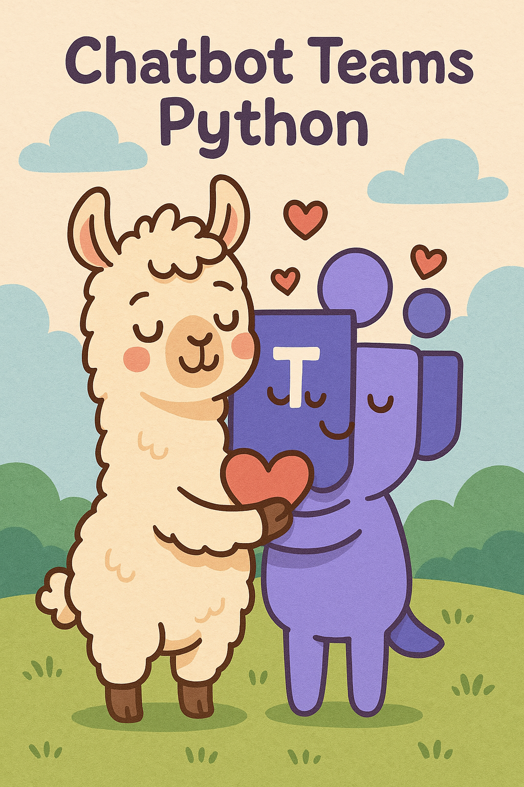
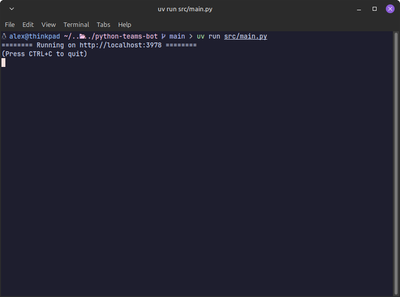
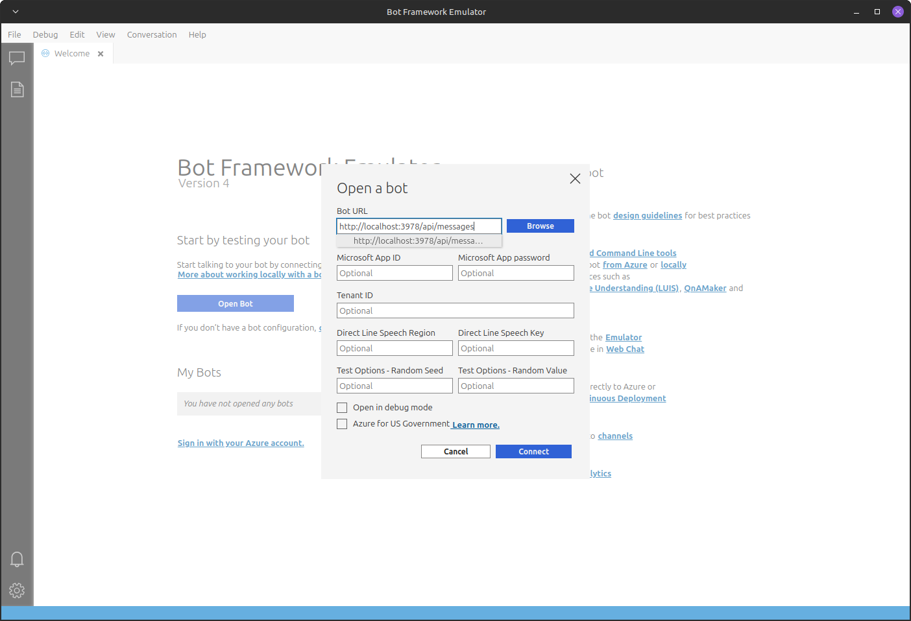

<div style="display: flex; align-items: start; justify-content: space-between;">

  <div style="flex: 1; padding-right: 20px;">
    <h1>Chatbot Teams Python</h1>
    <p>
        A very simple chabot implementation of teams trough the teams bot framework sdk. This is just a boilerplate to add an LLM and use it on teams
    </p>
  </div>

  <div>
    
  </div>
</div>


## Requirements

- `uv`: The ultra fast package manager for python
- `Bot Framework Emulator`: An emulator to test the bot in development you can download it [Here](https://github.com/Microsoft/BotFramework-Emulator/releases/tag/v4.15.1)

## Getting Started

1. **Clone the repository**

Clone the repository to your machine to get the code

```bash
git clone https://github.com/FredeAlexandre/python-teams-bot
cd python-teams-bot
```

2. **Install the requirements**

We use `uv` as package manger in this repository so to install requirements and dependencies run the following command

```bash
uv sync
```

3. **Run the bot in a terminal**

To run the bot you simply have to run the following command

```bash
uv run src/main.py
```

You should have something like this



4. **Use the emulator**

    1. Launch the download executable from [here](https://github.com/Microsoft/BotFramework-Emulator/releases/tag/v4.15.1)
    2. Click "Open Bot"
    3. Enter the information of the bot  like this




5. **Enjoy testing your bot !**

The setup is finish enjoy your bot
